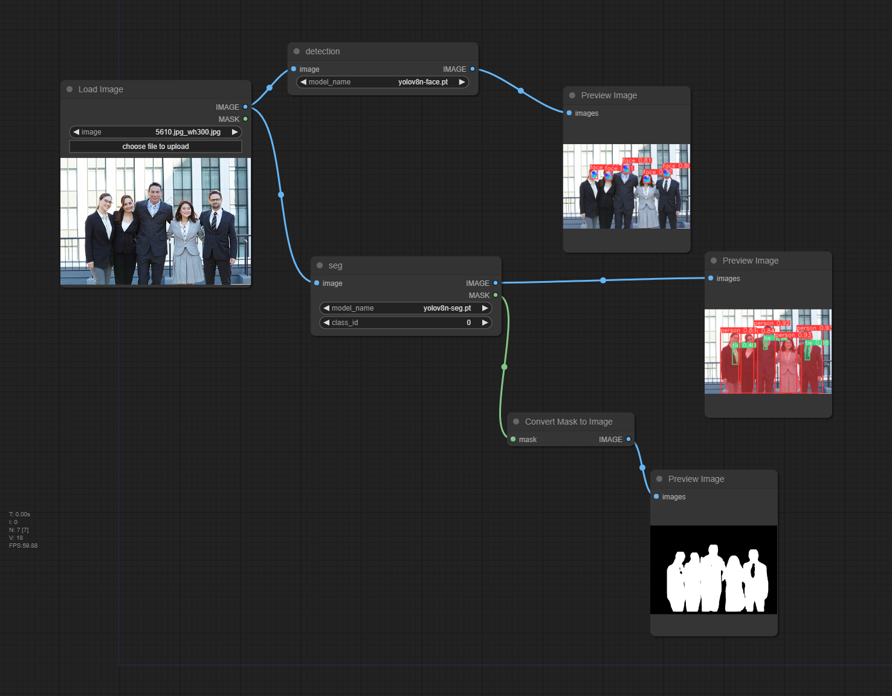

ComfyUI Yolov8
=======

> deadly simple yolov8 comfyui plugin

## INSTALL

1. in comfyui `custom_nodes` dir and `https://github.com/zcfrank1st/Comfyui-Yolov8.git`
2. put detect or seg models in comfyui `models/yolov8` dir
3. video support

## EXAMPLE

